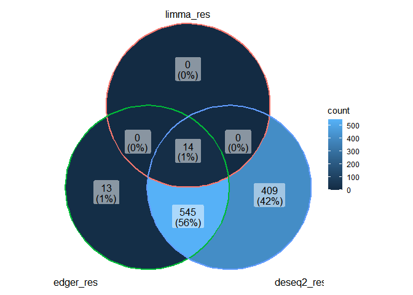

<!-- README.md is generated from README.Rmd. Please edit that file -->

# diffexpR

<!-- badges: start -->
<!-- badges: end -->

The goal of `diffexpR` is to easy do differential expression analysis.

## Installation

You can install the released version of diffexpR from
[Github](https://github.com/Moonerss/diffexpR) with:

``` r
install.packages('remotes')
remotes::install_github('Moonerss/diffexpR')
```

## Usage

We can do differential expression analysis underline the methods apply
by `limma`, `DESeq2`, and `edgeR`.

``` r
library(diffexpR)

## add data
data("OSCC")
data("eset")

## do differential expression analysis in array data
array_res <- diff_limma_array(array_mat = eset$array, label_list = eset$group, groups = 'brain-liver')
head(array_res)
#>                logFC   AveExpr         t      P.Value    adj.P.Val        B
#> 36781_at   -6.328881 11.701151 -66.58976 7.546173e-13 9.527798e-09 18.80203
#> 38839_at    4.690396  9.537184  53.75160 4.636910e-12 2.927281e-08 17.65523
#> 36984_f_at -5.920635 11.063179 -48.29727 1.147711e-11 3.451344e-08 17.00528
#> 35822_at   -4.535625  9.861791 -48.09034 1.190205e-11 3.451344e-08 16.97819
#> 33990_at   -5.881176  9.124178 -45.41456 1.932413e-11 3.451344e-08 16.60973
#> 33377_at   -6.686242 11.047807 -44.95467 2.106257e-11 3.451344e-08 16.54285

## do differential expression analysis in count data
limma_count_res <- diff_limma_count(count_mat = OSCC$count, label_list = OSCC$group, groups = 'tumor-normal', methods = 'voom')
head(limma_count_res)
#>           logFC  AveExpr         t      P.Value  adj.P.Val        B
#> 23328 -3.359522 6.020708 -9.962093 6.607450e-06 0.03906681 4.286401
#> 487   -4.482566 4.691778 -9.407894 1.026908e-05 0.03906681 3.590750
#> 5744   3.997323 5.182639  9.017082 1.420378e-05 0.03906681 3.541065
#> 4008  -2.461583 6.656455 -8.557298 2.112511e-05 0.03906681 3.304213
#> 7049  -3.428197 4.580525 -8.486091 2.249960e-05 0.03906681 3.109346
#> 23428  2.705798 6.845441  8.221803 2.853915e-05 0.04247441 3.017427

deseq2_count_res <- diff_deseq2_count(count_mat = OSCC$count, label_list = OSCC$group, groups = c('condition', 'tumor', 'normal'))
#> converting counts to integer mode
#> estimating size factors
#> estimating dispersions
#> gene-wise dispersion estimates
#> mean-dispersion relationship
#> final dispersion estimates
#> fitting model and testing
head(deseq2_count_res)
#>        baseMean log2FoldChange     lfcSE       stat      pvalue       padj
#> 378938 442800.2    -0.15972504 0.3942520 -0.4051344 0.685378739 0.88153819
#> 7273   299965.3    -3.57681760 1.1699933 -3.0571265 0.002234699 0.02918056
#> 9301   217031.0    -1.04421957 0.7789888 -1.3404808 0.180089085 0.49395863
#> 9302   220624.2    -0.38784864 0.6390947 -0.6068719 0.543935915 0.80897043
#> 3860   200614.6    -3.41785404 1.1456725 -2.9832732 0.002851833 0.03532593
#> 283131 146658.3    -0.08613695 0.5716606 -0.1506785 0.880229351 0.96181284

edger_count_res <- diff_edger_count(count_mat = OSCC$count, label_list = OSCC$group, groups = 'tumor-normal')
head(edger_count_res)
#>              logFC   logCPM          LR     PValue       FDR
#> 378938  0.09985532 15.20968 0.023583963 0.87794823 0.9611649
#> 7273   -3.34074199 14.64168 6.012740136 0.01420296 0.1334233
#> 9301   -0.61495824 14.00558 0.595193802 0.44041771 0.7452122
#> 9302   -0.03235385 14.11700 0.002089412 0.96354132 0.9897320
#> 3860   -3.27177747 13.98894 6.424946563 0.01125283 0.1156844
#> 283131  0.06461631 13.67219 0.007508207 0.93094979 0.9795611

## do differential expression analysis in normalized rna-seq data
limma_normalize_res <- diff_limma_normalize(expr_mat = OSCC$rpkm, label_list = OSCC$group, groups = 'tumor-normal')
#> The data didn't log2 tranform, do it ...
head(limma_normalize_res)
#>           logFC  AveExpr         t      P.Value   adj.P.Val        B
#> 487   -2.162600 1.389077 -9.495564 1.568959e-06 0.009874003 5.409303
#> 5837  -2.973479 1.836746 -9.265067 1.986457e-06 0.009874003 5.212258
#> 5744   2.882265 2.099697  8.701345 3.609777e-06 0.009874003 4.705221
#> 844   -2.367279 1.392456 -8.656301 3.791132e-06 0.009874003 4.663107
#> 54209  1.568041 1.023950  8.220780 6.153340e-06 0.012821099 4.243103
#> 7148  -3.149256 2.565681 -7.802885 9.976082e-06 0.013621104 3.817375
```

Compare the result of three different methods:

``` r
library(dplyr)
#> 
#> Attaching package: 'dplyr'
#> The following objects are masked from 'package:stats':
#> 
#>     filter, lag
#> The following objects are masked from 'package:base':
#> 
#>     intersect, setdiff, setequal, union
library(ggVennDiagram)

edger_res <- rownames(filter(edger_count_res, FDR < 0.05, abs(logFC) > 1))
deseq2_res <- rownames(filter(deseq2_count_res, padj < 0.05, abs(log2FoldChange) > 1))
limma_res <- rownames(filter(limma_count_res, adj.P.Val < 0.05, abs(logFC) > 1))

## veen 
x <- list(limma_res = limma_res, edger_res = edger_res, deseq2_res = deseq2_res)
ggVennDiagram(x)
```


